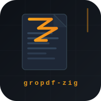

# A groff PDF device written in zig



The original UNIX typesetting system `roff` (from 'runoff') has a GNU
implementation called `groff`, which you will very likely have installed on
your system if you use MacOS, a Linux distribution, or Windows with MinGW or
WSL. It is used today mainly to typeset man pages in the terminal, but actually
it's much more powerful. Using macro packages like, `ms` or `mom`, you can
produce beautifully typeset documents in `dvi`, `ps` or `pdf` format.

To produce the mentioned output formats `groff` uses so called devices. These
devices encapsulate the implementation details for producing a format and
decouple this logic from the rest of `groff`'s functionality. The front-end
talks to the device in a language called `groff_out(5)` (`grout` for short).

I was happily using the PDF output device, `gropdf.pl` for quite some time now,
but its implementation language `perl` always gave my an itch. Not, that I
don't like `perl` - I've written my fair share in it in the past - it's just
not the first language I would think of, when thinking about speed.

Motivated by the approachability of `gropdf.pl` (
[sources](https://cgit.git.savannah.gnu.org/cgit/groff.git/tree/src/devices/gropdf/gropdf.pl), 
[man page](https://man7.org/linux/man-pages/man1/gropdf.1.html))
and the PDF spec, or to be exact, adobe's 
[pdf reference 1.7](https://opensource.adobe.com/dc-acrobat-sdk-docs/pdfstandards/pdfreference1.7old.pdf),
I started this little experiment to see
if I could implement a reasonable subset of `groff_out(5)`.

> [!WARNING]
> This is **very experimental** software. No guarantee is provided, that it will
> produce sensible output, will not crash and or stay stable in its behaviour.

At the moment, we implement a _small subset_ of the `grout` language only:

* All standard PDF fonts (Times, Helvetica, Courier, Symbol, ZapfDingbats)
  are referenced by name without embedding — the PDF viewer supplies the
  glyphs.  groff's default fonts (`TR`, `TB`, `TI`, `CR`, …) map directly
  to these standard fonts.
* For fonts that have no standard PDF equivalent, gropdf.zig searches the
  system font directories for a matching Type1 PFA file, subsets it to only
  the glyphs actually used, and embeds the result directly in the PDF.
* All PDF streams (page content and embedded font data) are compressed with
  zlib (FlateDecode), keeping output files compact.
* Only line drawing commands are interpreted — enough for header or footer
  lines.

## Usage

A sample input file lives in `samples/input.mom`.  It can be rendered to a
PDF using the native groff device for comparison:

```bash
groff -Tpdf -mom samples/input.mom > samples/orig.pdf
```

As our device reads `grout` (groff intermediate output), convert first:

```bash
groff -Tpdf -Z -mom samples/input.mom > samples/input.grout
```

Then render with gropdf.zig:

```bash
zig build run < samples/input.grout > samples/out.pdf
```

and inspect it using any PDF viewer.  On macOS:

```bash
open samples/out.pdf
```

### Pipeline (no intermediate file)

```bash
groff -Tpdf -Z -mom samples/input.mom | ./zig-out/bin/gropdf_zig > samples/out.pdf
```

## Output size

For the three-page demo document using groff's default fonts (Times, Courier):

| Configuration | File size |
|---|---|
| `groff -Tpdf` (standard fonts + FlateDecode) | ~7.8 KB |
| gropdf.zig standard fonts + FlateDecode | ~9.8 KB |
| gropdf.zig embedded + subsetted fonts + FlateDecode | ~44 KB |

The small remaining gap vs. native groff is due to the explicit `/Encoding`
dictionary gropdf.zig adds to every font.  See [docs/fonts.md](docs/fonts.md)
for a full explanation of font selection, subsetting, and compression.


## Performance

Run `./bench.sh [runs]` to reproduce the timings on your machine (default 50
runs, both debug and release builds are compiled automatically):

```bash
$ ./bench.sh 30
gropdf (perl)…           123 ms
gropdf.zig (debug)…       29 ms
gropdf.zig (release)…     24 ms
```

That is roughly a **4× speedup** over the Perl implementation, even for the
debug build.  The debug/release gap is narrower than in earlier versions
because zlib compression (done via system libz) now dominates the hot path —
an already-optimised C library that debug symbols don't slow down.

The release binary is `209k` on macOS (Apple Silicon):

```bash
$ ls -lh zig-out-rel/bin/gropdf_zig
-rwxr-xr-x  209k gropdf_zig
```

